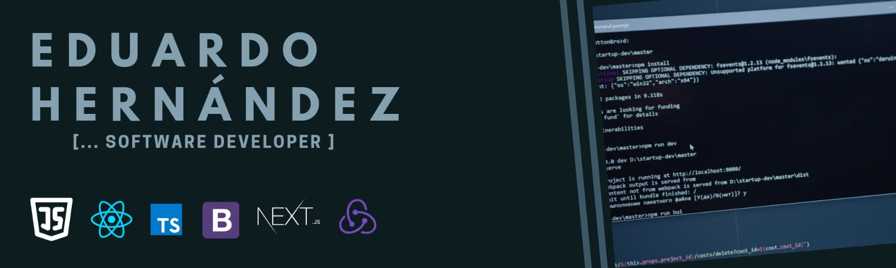

Hello everyone! 🤝 I am an electrical engineer 🤓 who has always been interested in using techs to resolve problems. A few years ago, I have been working with techs on web development, fortunately, my background in math and logical thinking from engineering helped me to advance fast and I feel very comfortable with coding for application development or learning new techs.

<!--
**Edjhernandez/Edjhernandez** is a ✨ _special_ ✨ repository because its `README.md` (this file) appears on your GitHub profile.

Here are some ideas to get you started:

- 🔭 I’m currently working on ...
- 🌱 I’m currently learning ...
- 👯 I’m looking to collaborate on ...
- 🤔 I’m looking for help with ...
- 💬 Ask me about ...
- 📫 How to reach me: ...
- 😄 Pronouns: ...
- ⚡ Fun fact: ...
-->
